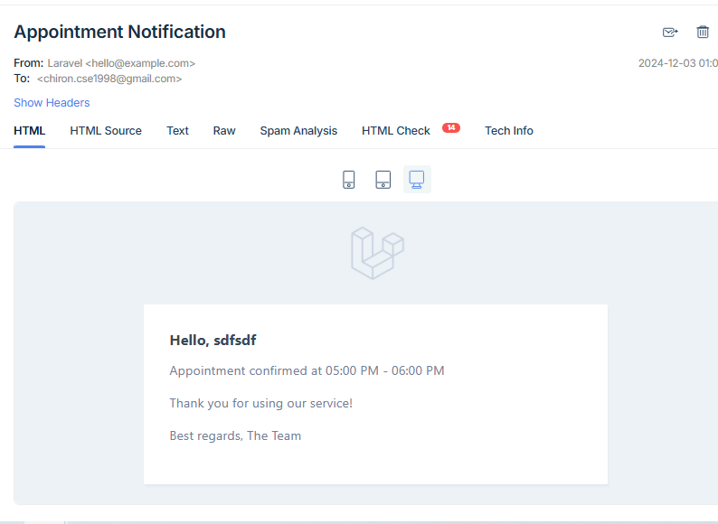

### Project Title
Doctor Appointment Management System (Based on Laravel and React.Js, Mysql)


## Table of Contents
1. [Introduction](#introduction)  
   1.1 [Overview of the System](#overview-of-the-system)  
   1.2 [Key Features](#key-features)  

2. [User Roles and Functionalities](#user-roles-and-functionalities)  
   2.1 [Patients](#patients)  
   - [Registration and Login](#registration-and-login)  
   - [Appointment Booking, Confirmation, and Cancellation](#appointment-booking-confirmation-and-cancellation)  
   - [Email Notifications](#email-notifications)  

   2.2 [Doctors](#doctors)  
   - [Secure Login](#secure-login)  
   - [Calendar Availability Management (1-hour Slots)](#calendar-availability-management-1-hour-slots)  
   - [View Upcoming Appointments](#view-upcoming-appointments)  
   - [Appointment Cancellation with Email Notifications](#appointment-cancellation-with-email-notifications)  

   2.3 [Admin](#admin)  
   - [Manage Calendar Availability](#manage-calendar-availability)  
   - [View and Manage Appointments](#view-and-manage-appointments)  
   - [Send Notifications](#send-notifications)  

3. [Frontend Development](#frontend-development)  
   3.1 [Technology Stack](#technology-stack)  
   3.2 [User Interface Features](#user-interface-features)  
   - [Patient Registration Form](#patient-registration-form)  
   - [Calendar View for Slot Availability](#calendar-view-for-slot-availability)  
   - [Booking Confirmation Page](#booking-confirmation-page)  

4. [Backend Features](#backend-features)  
   4.1 [Appointment Management](#appointment-management)  
   4.2 [Notification System](#notification-system)  

5. [System Flow](#system-flow)  
   5.1 [Patient Journey](#patient-journey)  
   5.2 [Doctor/Admin Workflow](#doctor-admin-workflow)  

6. [Deployment and Scalability](#deployment-and-scalability)  
   6.1 [Hosting Requirements](#hosting-requirements)  
   6.2 [System Performance](#system-performance)  

7. [Future Enhancements](#future-enhancements)  
   7.1 [Payment Integration](#payment-integration)  
   7.2 [Advanced Reporting Tools](#advanced-reporting-tools)  

8. [Conclusion](#conclusion)

---

## Introduction

### Overview of the System
The **Doctor Appointment Management System**  is a comprehensive platform designed to streamline doctor-patient interactions and appointment scheduling. The system enables patients to register, log in, and book appointments with doctors via an intuitive interface. Patients receive email notifications for confirmed or canceled appointments. Doctors have a secure login to manage their schedules in 1-hour slots, view upcoming appointments, and cancel appointments with automated user notifications. The Admin Dashboard offers seamless control over calendar availability and appointment management. Built with ReactJS for a user-friendly frontend, the system includes features like a registration form, calendar views for available slots, and a booking confirmation page.

### Key Features
- Patient registration and login.
- Appointment booking, confirmation, and cancellation.
- Email notifications for appointment updates.
- Admin dashboard for managing doctor schedules and appointments.

---

## Installation Guide

### Prerequisites
Before setting up the project, make sure you have the following installed:
- **PHP** (8.0+)
- **Composer** (for managing PHP dependencies)
- **Node.js** and **npm** (for managing ReactJS dependencies)
- **MySQL** or another supported database

### Steps to Install

1. **Clone the Repository**
   ```bash
   git clone https://github.com/ciron/booking-appointment-system.git
   cd doctor-appointment-system
2. **Install Backend Dependencies (Laravel) Navigate to the Laravel project folder and run:**
   ```bash   
   composer install
3. **Set Up Environment Variables Copy the .env.example file to .env:**
   ```bash   
   cp .env.example .env
   php artisan key:generate
4. **Next, install Passport by running the following command. This will generate the encryption keys Passport needs for API authentication:**
   ```bash   
   php artisan passport:install
  
5. **Run Passport Migrations:**
   ```bash   
   php artisan migrate
6. **Run Seeder command for dammy patient and doctor:**
   ```bash   
   php artisan db:seed
      
7. **Run Local Server:**
    ```bash
   php artisan serve
   
8.  **For Frontend:**  i have did it in same project and use vite.config.js to render react component, and  vite.config.js file render in resources/views/welcome.blade.php  file. when user hit public url its redirect from web.php to welcome.blade.php and its redirect all react component. As its same project so if we give command in root directory then its working,  

    ```bash   
    npm install
    npm run dev    (for dev/local)
    npm run build   (for live)
    
After that if user Hit this url http://127.0.0.1:8000/ its automatic redirect on login page if user not authenticate as patient, if authenticate its redirect in doctor list.

Live Url is : https://demo.dadacuisine.com/

Patient Credentials: 
Email:patient@gmail.com
password:123456


## User Roles and Functionalities

### Patients
#### Registration and Login 
Patients can easily register and log in to the system to access appointment services.


#### Appointment Booking 
Patients can view available slots, book appointments, Able to see all appointment list from today.

#### Email Notifications
Automated email notifications are sent for appointment confirmations and cancellations.

### Doctors
#### Secure Login
Doctors can log in securely to access their dashboard. Here is the url   (http://127.0.0.1:8000/doctor/login).  

Live url ( https://demo.dadacuisine.com/doctor/login)

Doctor Credentials: 

Email:doctor@gmail.com

password:123456

#### Calendar Availability Management (1-hour Slots)
Doctors can manage their availability by specifying time slots.
First need to add timeslot here by date wise. select date first then below dropdown all avilable slot is show (which is not created before) , you can select multiple here also. 

#### View Upcoming Appointments
Doctors can view a list of their upcoming appointments.

#### Appointment Confirmation/ Cancellation with Email Notifications
Doctors can Confirm/ cancel appointments, and the system will notify patients via email.



## Frontend Development

### Technology Stack
The frontend is developed using **ReactJS** for a modern and interactive user experience.

### User Interface Features
#### Patient Registration Form
An easy-to-use form for new users to register.

#### Calendar View for Slot Availability
A calendar interface displays available appointment slots.

#### Booking Confirmation Page
Patients can review and confirm their appointments.

---

## Backend Features

### Appointment Management
Efficient handling of appointment data, including CRUD operations.

### Notification System
Automated email notifications for appointment updates.

---

## System Flow

### Patient Journey
1. Register and log in.  
2. View available slots and book an appointment.  
3. Receive email notifications for updates.

### Doctor/Admin Workflow
1. Log in securely.  
2. Manage calendar availability.  
3. View and manage appointments.  
4. Notify users about appointment changes.

---

## Deployment and Scalability

### Hosting Requirements
The system can be hosted on any server supporting **Laravel** and **ReactJS** applications.

### System Performance
Optimized to handle multiple simultaneous users with scalable backend architecture.

---

## Future Enhancements

### Payment Integration
Enable patients to pay for appointments online.

### Advanced Reporting Tools
Provide analytics and reports for admins and doctors.

---

## Conclusion
The **Doctor Appointment Management System** provides a streamlined and user-friendly solution for managing doctor schedules and patient appointments. With future enhancements, it aims to become a more robust and comprehensive platform.
